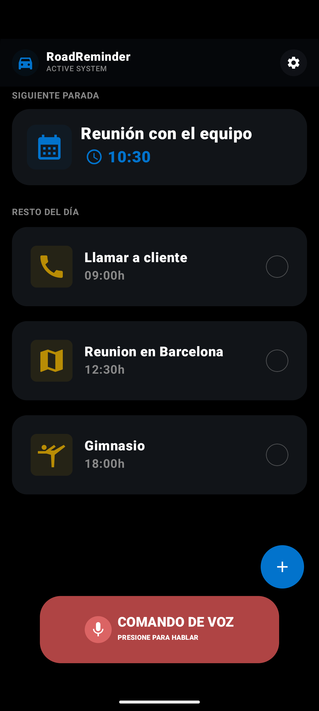
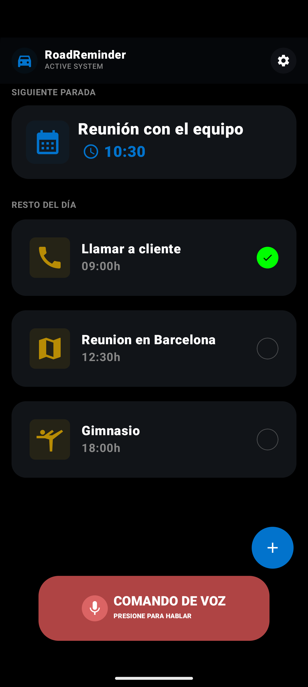

# 🚗 RoadReminder

<div align="center">
  
  
  
  
</div>

<div align="center">
  <h3>Tu asistente inteligente para gestionar eventos en la carretera</h3>
  <p>Una aplicación Android moderna desarrollada con Jetpack Compose que te ayuda a organizar y recordar tus eventos mientras conduces.</p>
</div>

---

## 📱 Sobre el Proyecto

**RoadReminder** es una aplicación Android diseñada específicamente para conductores que necesitan gestionar sus eventos diarios de forma eficiente y segura. Con una interfaz intuitiva y comandos de voz, podrás organizar tus paradas, reuniones y tareas sin apartar la vista de la carretera.

### ✨ Características Principales

- 🎯 **Visualización de eventos del día** - Lista completa de todos tus eventos organizados por hora
- 🔔 **Próxima parada destacada** - Tarjeta especial que muestra tu siguiente evento
- 🎤 **Comandos de voz** - Control por voz para mayor seguridad mientras conduces
- 🌙 **Tema oscuro** - Diseño optimizado para conducción nocturna con reducción de fatiga visual
- 📍 **Detalles de eventos** - Información completa de cada evento con iconos personalizados
- 🎨 **UI/UX moderna** - Interfaz fluida desarrollada con Material Design 3

---

## 🏗️ Arquitectura

El proyecto sigue el patrón **MVVM (Model-View-ViewModel)** con Clean Architecture, garantizando:

- ✅ Separación clara de responsabilidades
- ✅ Código mantenible y escalable
- ✅ Facilidad para testing
- ✅ Reutilización de componentes

### 📦 Estructura del Proyecto

```
com.xaviboro.roadreminder/
│
├── data/                           # Capa de datos
│   ├── datasource/                # Fuentes de datos
│   │   └── FakeEventDataSource    # Datos de prueba
│   ├── repository/                # Repositorios
│   │   └── EventRepository        # Interfaz del repositorio
│   └── Event.kt                   # Modelo de datos
│
├── domain/                        # Lógica de negocio
│   └── usecase/                   # Casos de uso
│       └── GetEventUseCase        # Obtener eventos
│
└── ui/                            # Capa de presentación
    ├── components/                # Componentes reutilizables
    │   ├── TopBar                 # Barra superior
    │   ├── EventRow               # Elemento de lista
    │   ├── NextEventCard          # Tarjeta próximo evento
    │   └── VoiceCommandButton     # Botón de voz
    │
    ├── home/                      # Pantalla principal
    │   ├── HomeScreen             # Composable principal
    │   ├── HomeContent            # Contenido de la UI
    │   ├── HomeViewModel          # Lógica de negocio
    │   └── HomeState              # Estado de la UI
    │
    ├── eventdetail/               # Detalles de evento
    │   ├── EventDetailScreen      # Pantalla de detalles
    │   ├── EventDetailViewModel   # ViewModel de detalles
    │   └── EventDetailState       # Estado de detalles
    │
    ├── Navigation.kt              # Navegación de la app
    └── theme/                     # Tema y colores
```

---

## 🛠️ Tecnologías y Librerías

### Core
- **Kotlin** `2.0.21` - Lenguaje principal
- **Android SDK** `26+` (Mínimo) / `36` (Target)
- **Gradle** `8.13.2` - Sistema de build

### Jetpack Compose
- **Compose BOM** `2024.09.00` - Bill of Materials
- **Material 3** - Sistema de diseño moderno
- **Navigation Compose** `2.7.3` - Navegación entre pantallas
- **Material Icons Extended** `1.5.0` - Iconos expandidos

### Android Jetpack
- **Core KTX** `1.17.0` - Extensiones de Kotlin para Android
- **Lifecycle Runtime KTX** `2.10.0` - Manejo del ciclo de vida
- **Activity Compose** `1.12.2` - Integración de Activity con Compose
- **ViewModel** - Manejo de estado y lógica de UI

---

## 🚀 Instalación y Configuración

### Requisitos Previos

- **Android Studio** Hedgehog (2023.1.1) o superior
- **JDK** 11 o superior
- **Android SDK** API 26 o superior
- **Gradle** 8.x

---

## 📸 Capturas de Pantalla

### Pantalla Principal (Home Screen)




<div align="center">
  
  
</div>

**Características:**
- 📋 Lista de eventos del día organizados por hora
- ⭐ Tarjeta destacada del próximo evento
- ➕ Botón flotante para añadir nuevos eventos
- 🎤 Botón de comando de voz en la parte inferior

---

### Detalles de Evento (Event Detail Screen)


<div align="center">
  
</div>

**Características:**
- 🎯 Icono personalizado del evento con fondo de color
- 📝 Título y hora del evento
- ⬅️ Botón "VOLVER" para regresar a la pantalla principal

---

## 🔄 Roadmap

### ✅ Completado (v1.0)
- [x] Arquitectura MVVM base
- [x] Pantalla principal con lista de eventos
- [x] Pantalla de detalles de evento
- [x] Navegación entre pantallas
- [x] Componentes UI reutilizables
- [x] Tema oscuro personalizado

### 🚧 En Desarrollo (v1.1)
- [ ] Integración de base de datos (Room)
- [ ] Funcionalidad de añadir/editar eventos
- [ ] Sincronización con Google Calendar
- [ ] Notificaciones push

### 🔮 Futuro (v2.0)
- [ ] Implementación de comandos de voz reales
- [ ] Integración con Google Maps para rutas
- [ ] Widget de pantalla de inicio

---


### Guías de Estilo

- Sigue las convenciones de código de Kotlin
- Usa nombres descriptivos para variables y funciones
- Comenta código complejo
- Escribe tests para nuevas funcionalidades

---

## 📄 Licencia

Este proyecto está bajo la licencia MIT. Ver el archivo [LICENSE](LICENSE) para más detalles.

---

## 👨‍💻 Autor

**Xavi Boniquet Rodriguez**
- GitHub: [@XaviBoRo](https://github.com/XaviBoRo)
- Email: xavi.boniquet@gmail.com

---


## 📱 Compatibilidad

- **Versión mínima de Android**: 8.0 Oreo (API 26)
- **Versión objetivo**: Android 14 (API 36)
- **Orientación**: Portrait
- **Idiomas**: Español (más idiomas próximamente)

---

<div align="center">
  <p>Hecho con ❤️ y Kotlin</p>
  <p>© 2026 RoadReminder - Todos los derechos reservados</p>
</div>

